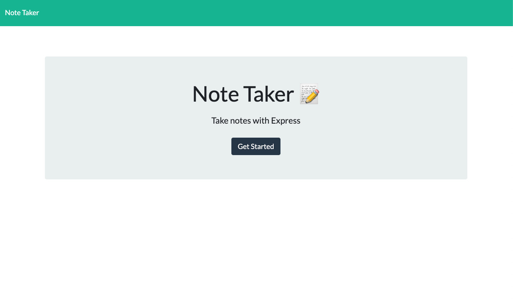
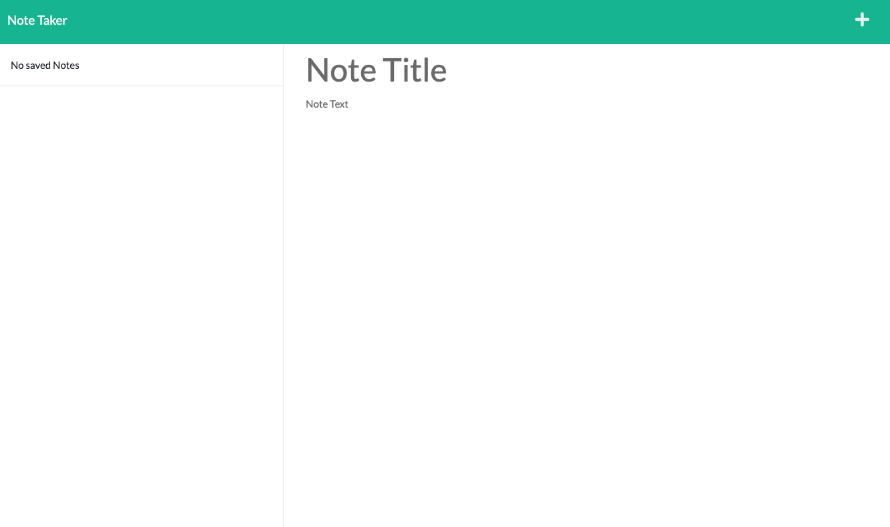
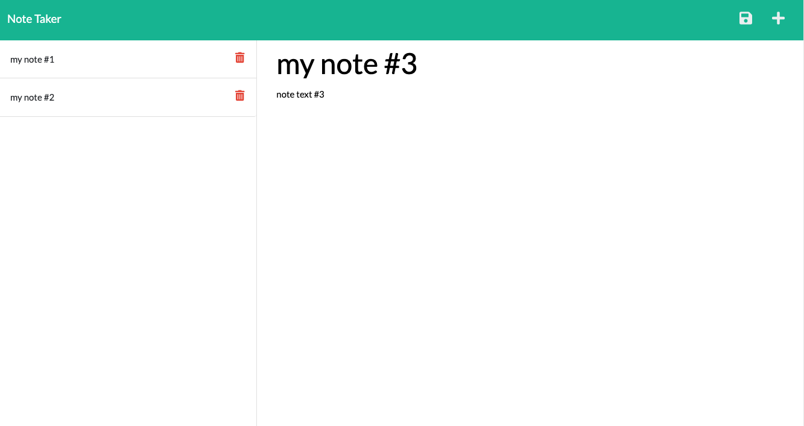
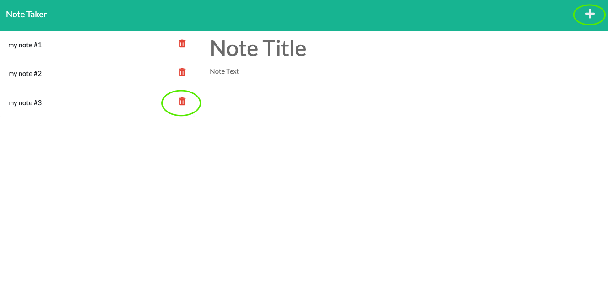
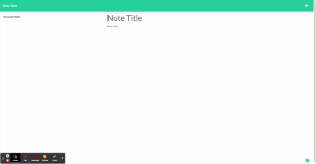

# Memo-Pad 

  ## Table of contents:
  ### 
  1. [Description](#description)
  2. [Features](#features)
3. [Installation](#installation)
4. [Demo](#demo)
5. [License](#license)
6. [Tests](#tests)
7. [Questions](#questions)

  ---

  ## Description 
  ### A note tracker which can be able to wirte, save and delete notes for business owners, so that they can easily organize their thoughts and keep track of tasks which need to complete.
  ---
  ## Features

   * presented with a landing page with a link to a notes page
   * a page with existing notes listed in the left-hand column, plus empty fields to enter a new note title and the note’s text in the right-hand column
   * a Save icon appears in the navigation at the top of the page
   * function with delete option after note title
   
   
   
   
   
  ---
  ## Installation
   * inquirer package (npm i inquirer@8.2.4), 
   * Heruko

  ---

  ## Demo

  

  ---

  ## License
  ### MIT
  * Read more about MIT: https://opensource.org/licenses/MIT 

  ---

  ## Tests 
    Command to Run Tests: Node server.js (or:  nmp start )
  ---
  
  ## Questions
  ### Reach me with additional questions:
  * Github Link: https://github.com/ahhyaya
  * Project Link(Github): https://github.com/ahhyaya/Memo-Pad
  * Project Link(Heroku): https://memo-pad-22.herokuapp.com/
  * Email Address: toruig59@gmail.com